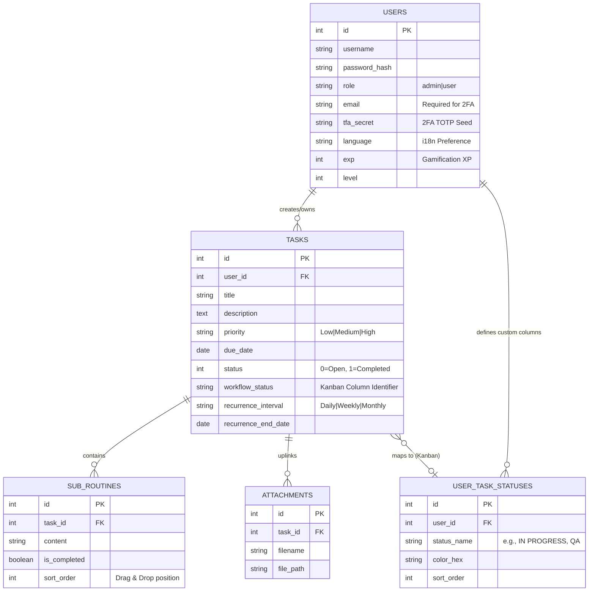

# CyberTasker v2.9.1 - Technical Reference

This document provides a highly detailed technical blueprint for CyberTasker, functioning as the single source of truth for the system's architecture, database schemas, and critical operational flows. 

---

## 1. System Architecture

CyberTasker employs a monolithic but internally decoupled architecture. It utilizes a modern React frontend hosted statically via Vite, which communicates asynchronously with a lightweight vanilla PHP REST-like API.

```mermaid
graph TD
    Client[Web Browser / Mobile Client] -->|HTTP/REST JSON| API[PHP API Router<br>index.php]
    
    subgraph Frontend [React 19 SPA]
        UI[React Components]
        State[React Context / Hooks]
        Router[React Router]
        I18n[i18next]
        Tailwind[Tailwind CSS v4]
        Kanban[@dnd-kit / Drag & Drop]
        
        UI <--> State
        UI <--> Router
        UI <--> I18n
        UI --> Tailwind
        UI <--> Kanban
    end

    Client <--> Frontend
    
    subgraph Backend [Vanilla PHP 8]
        API --> Auth[Auth Middleware / Session]
        Auth --> Controllers[Controllers<br>TaskRepository, UserRepository]
        Controllers --> Models[Models / Domain Logic]
        Models --> PDO[(PDO Interface)]
    end

    PDO --> DB_SQLite[(SQLite DB)]
    PDO -.-> DB_MySQL[(MySQL / MariaDB)]
```

### Key Technical Decisions:
*   **Vanilla PHP 8:** No heavyweight frameworks are used on the backend. This guarantees extremely low latency, minimal memory footprint, and trivial deployment on any host supporting standard PHP (including strict shared hosting environments like Strato).
*   **Vite & React 19:** Utilized for rapid HMR during development and optimized tree-shaking for production builds.
*   **Database Agnosticism:** The PDO layer is strictly tested via CI to support both SQLite (default portable mode) and MariaDB/MySQL effortlessly.

---

## 2. Database Schema (Entity-Relationship Diagram)

Relational integrity is maintained by PHP business logic on top of the database. Structural expansions in v2.8/v2.9 introduced custom task statuses and Kanban mapping.



---

## 3. Routing & API Lifecycle

The backend relies on a custom front-controller pattern configured via `.htaccess`. All incoming API requests are rewritten to `api/index.php`.

1.  **Request Ingestion:** `index.php` reads the `?route=` query parameter and standardizes the request payload (parsing JSON from `php://input` or `$_POST` for multipart forms).
2.  **Middleware Authorization:** Before reaching repositories, requests pass through `validate_session()` checks. Mutating endpoints (`POST`, `PUT`, `DELETE`) require rigorous **CSRF token** validation.
3.  **Dispatch:** Controller files handle domain logic. For instance, `route=tasks` mapped to a `GET` method dispatches to `TaskRepository.php -> getTasks()`.
4.  **Response Handling:** Controllers return normalized JSON structures strictly defined by the API contract.
5.  **External Syncing:** Certain external feeds (e.g., WebCal at `api/index.php?route=calendar_feed`) bypass standard cookie session authorization by exclusively validating uniquely generated 64-character `calendar_token` hashes provided in the URL `?token=` parameter.

---

## 4. Frontend Ecosystem

*   **Tailwind CSS v4:** Handles the entire design system and multi-theming through advanced CSS variables mapping.
*   **@dnd-kit:** Powers the interactive Drag & Drop capabilities. Actively used in both the Sub-Routine sorting lists and the 2D Kanban Board grids. It incorporates custom `TouchSensor` delays for stable mobile utilization.
*   **Localization (react-i18next):** 
    *   Translation dictionaries are dynamically loaded via HTTP backend.
    *   **Database Source of Truth:** The operative's language preference is stored in the database, overwriting browser `localStorage` upon authentication to ensure strict cross-device consistency. 
    *   A custom Python script (`scripts/check_translations.py`) exists in the CI pipeline to validate synchronization and prevent missing translation keys across 20+ supported languages.

---

## 5. Automated Quality Assurance

CyberTasker strictly enforces quality assurance using a comprehensive suite of **Playwright** End-to-End browser tests. 

### E2E Anti-Flakiness Protocol (React State Synchronization)
To guarantee 100% CI pass rates without timeouts or 409 Conflict errors across all SQL engines, the E2E architecture adheres to the following rules:
- **No Implicit Enter Keystrokes:** Playwright never uses `.press('Enter')` on forms, as it causes React synthetic events to overlap and duplicate.
- **Explicit Target Validation:** Tests locate explicit submit buttons (`getByRole('button')`) and click them.
- **Verified State Wiping:** Tests immediately `await expect(input).toHaveValue('');` to prove React has completed its asynchronous rendering cycle before proceeding.
- **Network Awaiting:** Tests asserting filter or pagination changes await the raw backend response (`page.waitForResponse`) instead of relying on subjective UI Tailwind classes.

---

## 6. CI/CD Release Pipeline

The project leverages automated GitHub Actions (`.github/workflows/e2e-tests.yml`) combined with local bash execution (`scripts/release.sh`).

1.  **Static Analysis:** Execution of `check_translations.py` and theme CSS bleed validators.
2.  **Cross-Database Matrices:** Dockerized GitHub containers spin up both SQLite and MariaDB instances concurrently. The Playwright suite executes against *both* databases to ensure strict PDO compliance.
3.  **Deployment Packaging:** The `release.sh` script increments version headers, builds the Vite `dist/` directory, and applies a signed Git tag for the master branch deployment.
